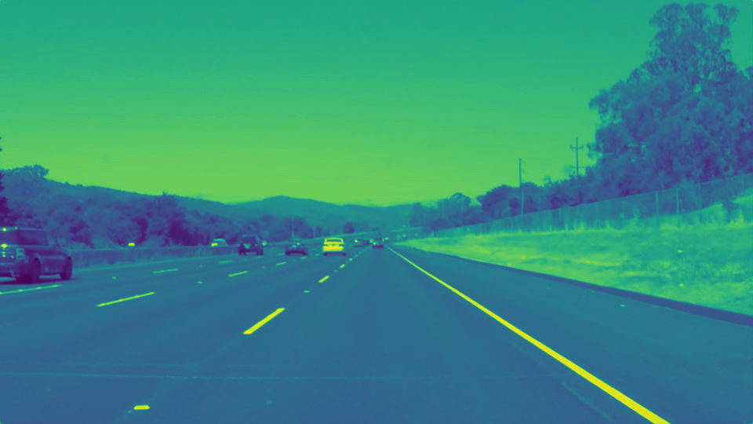
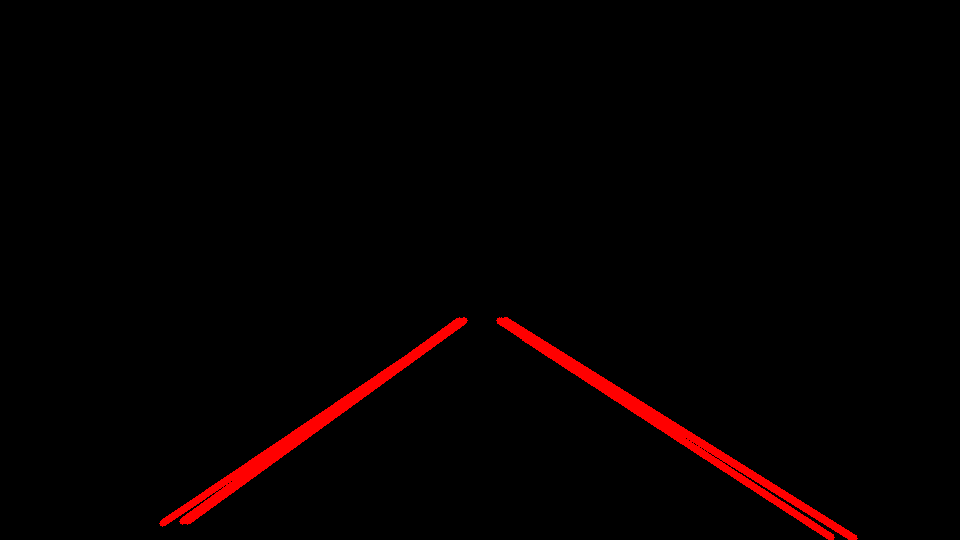
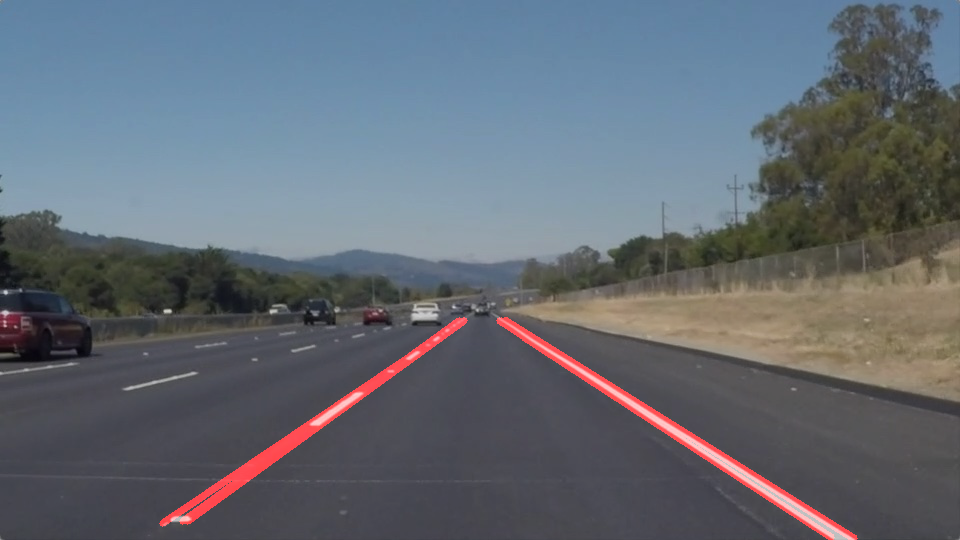

# Overview
----------------------------------------------------------

In this project, I will use the different tools of computer version to identify lane lines on a straight road. I will develop a pipeline on a series of individual images, and later apply the result to a video stream.

# Project
----------------------------------------------------------

The goals / steps of this project are the following:
* Make a pipeline that finds lane lines on the road
* Reflect on your work in a written report

# Pipeline
----------------------------------------------------------

My pipeline consisted of the following 6 steps.

1. Converted the images to grayscale from RGB model.

2. Use cv2.GaussianBlur() to blur the image.

3. Then, canny detection is used to detect edges of a gray model image.

4. The next step is to define a region of interest(ROI). The ROI is usually a trapazoidal region in the center of the image or video, as the camera is usually fixed to the center of the car.

5. The next step is to get hough transform. This transforms the edges to a set of lines represented by a start point and an end point. This creates the lane lines.

6. Finally, the lane lines image (Hough Transformed image) and initial image is added together to get the final image.

# Testing
---------------------------------------------------------

Now, it is time to test the pipeline on a video. For this the following videos are used:

<a href="test_videos/solidWhiteRight.mp4">solidWhiteRight.mp4</a>
<a href="test_videos/solidYellowLeft.mp4">solidYellowLeft.mp4</a>

When these videos are put through the pipeline, they add the lane lines and output the resulting video. These output videos can be found <a href="test_video_output/">here</a>.

# Reflection
--------------------------------------------------------

## Shortcomings
---------------------

One potential shortcoming of my pipeline would be that it can't find lane lines exactly when the lighting changes. This is because, in the grayscale of the image, the canny detection will detect the lighting changes as edges. So, the real lane lines can't be separated from the noise caused by the lighting changes.

Another shortcoming is that the pipeline cost too much time, which means that it can't be used in a real-life, real-time high speed driving scenario. This pipeline is more of a learning the ropes pipeline, rather than a deploy in your car pipeline.

## Possible improvements
---------------------------------

A possible improvement would be to use different Color Spaces, to differenetiate between the lighting changes and the lane lines, thus reducing the noise and getting a more precise lane detection.
Another improvement would be to adapt this pipeline to detect curving lanes, as it almost all roads curve along the way, and so, a pipeline that can detect curving lanes is even better, and will work in a real world scenario.

